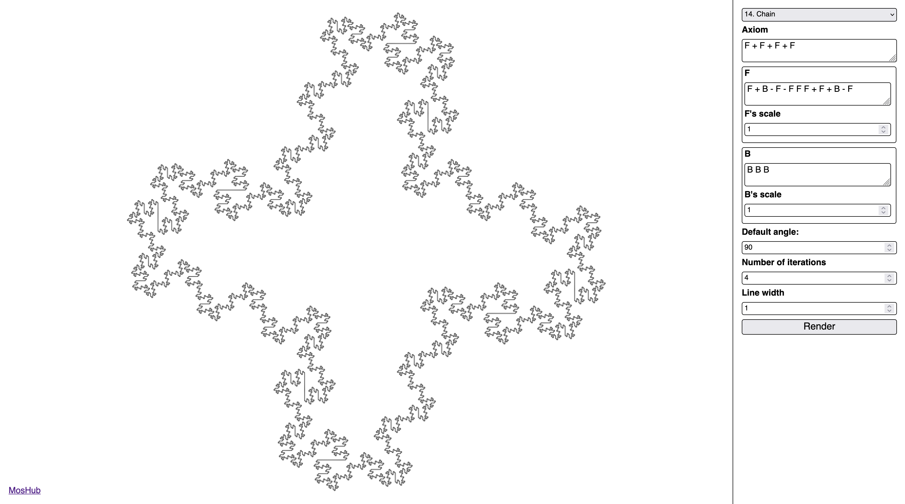

# L-System

## Table of Contents

- [Table of Contents](#table-of-contents);
- [About](#about);
- [Try](#try);
- [Building](#building);
- [Running](#running);
- [Gallery](#gallery).

## About

This is mini web-app for rendering fractals with use of [L-system](https://en.wikipedia.org/wiki/L-system).

## Try

You can try it [here](https://l-system.fominmv.ru)

## Building

For building you will need a [Node.js](https://nodejs.org/en).

After the installation of Node.js, first of all, set your current working directory to the root of this
repository. After it, install all dependencies with the following command:

```bash
npm i -D
```

And after it, if no errors were emitted, build web-app with the following command:

```bash
npm run build
```

If no errors were emitted, you must have a built web-app in the `./dist/` folder.

## Running

For running you will need a [Node.js](https://nodejs.org/en).

After the installation of Node.js, first of all, set your current working directory to the root of this
repository. After it, install all dependencies with the following command:

```bash
npm i -D
```

And after it, if no errors were emitted, you can run web-app with the following command:

```bash
npm start
```

If no errors were emitted, a browser must open with running web-app.
If browser didn't open automatically try to open [this page](http://localhost:8000).

## Gallery

### Harter-Haythaway's Dragon


### Serpinsky Carpet


### Hilbert Curve Filling the Plane


### Gosper Curve Filling the Plane


### The Serpinsky Curve Filling the Plane


### Bush


### Hagerty Mosaic


### Island


### Snowflake


### Koch's Snowflake


### The Peano Curve


### Weed


### Flower


### Chain


